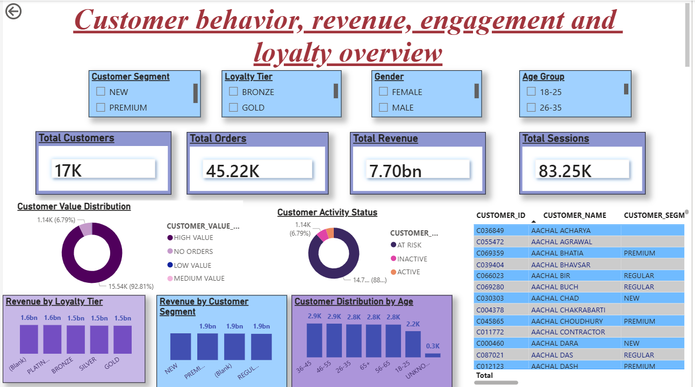
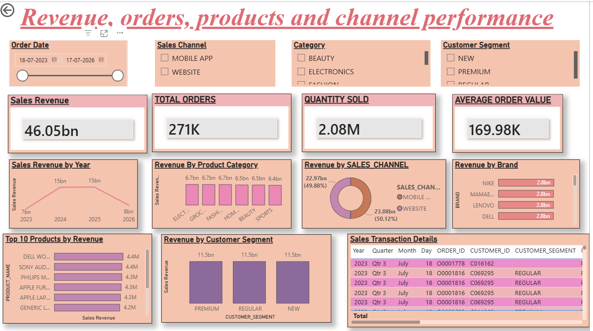
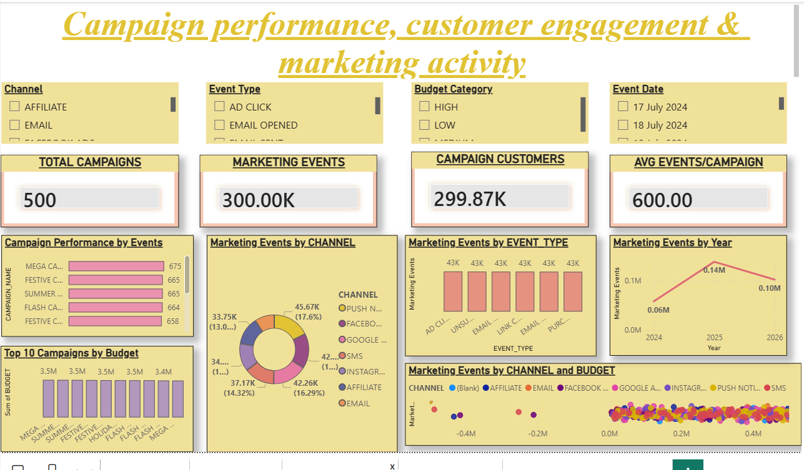
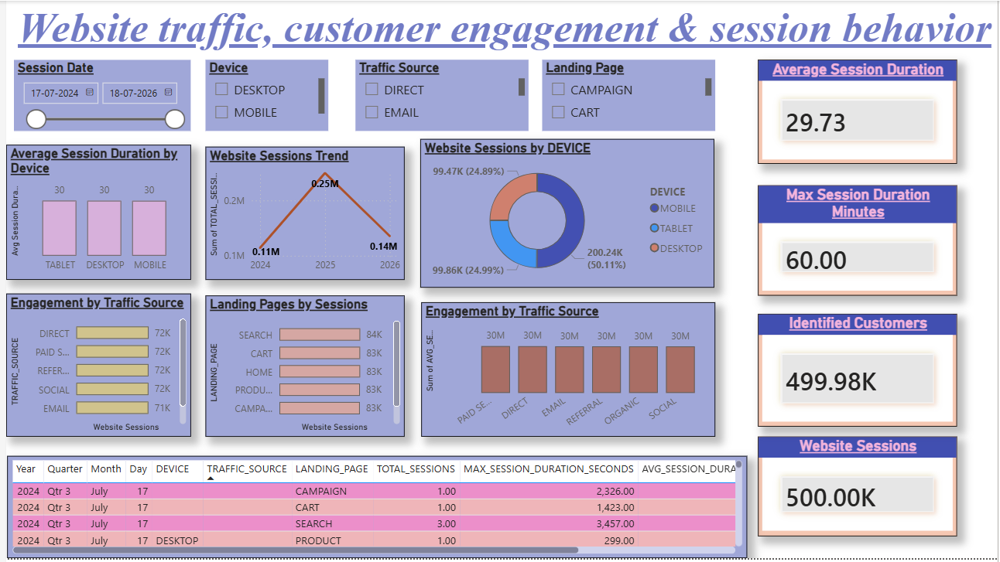
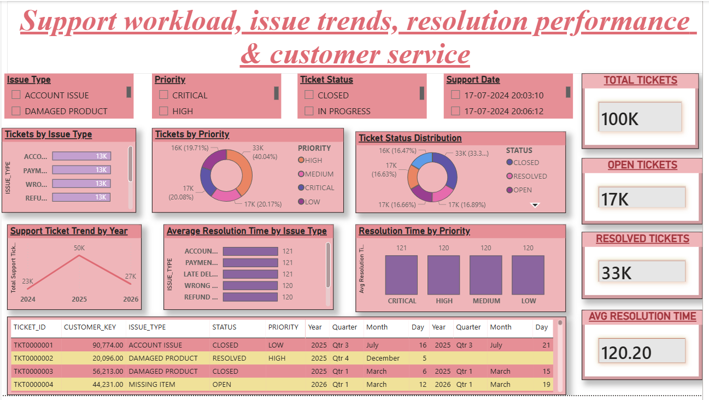

# Enterprise Customer Intelligence Platform

An end-to-end Customer 360 analytics project built using **Snowflake, dbt, SQL, AWS S3, and Power BI**.

The project brings together customer, sales, marketing, website, loyalty, reviews, and customer support data to create a unified view of customers and business performance.

## Tools & Technologies

- Snowflake
- dbt
- SQL
- AWS S3
- Power BI
- Git & GitHub

## Data Domains

- Customers
- Orders & Order Items
- Products
- Payments
- Website Sessions
- Marketing Campaigns & Events
- Customer Support
- Reviews
- Loyalty Transactions

## What This Project Covers

- Customer 360 analysis
- Customer segmentation
- Revenue and sales analysis
- Product and category performance
- Marketing campaign analysis
- Website engagement analysis
- Customer support analysis
- Data cleaning and transformation
- Data quality validation
- Business KPI development

## Power BI Dashboards

### Customer 360

### Sales Analytics

### Marketing Analytics

### Website Analytics

### Customer Support Analytics

## Key KPIs

- Total Customers
- Total Revenue
- Total Orders
- Total Sessions
- Average Order Value
- Quantity Sold
- Customer Value Segment
- Customer Activity Status
- Marketing Events
- Campaign Customers
- Average Session Duration
- Support Tickets
- Open & Resolved Tickets
- Average Resolution Time

## dbt

The dbt project is used for:

- Data cleaning and standardization
- Deduplication
- Transformation
- Intermediate business logic
- Fact and dimension modeling
- KPI creation
- Data quality testing
- Monitoring

## Project Highlights

- Built a complete Customer 360 analytical solution
- Processed multiple business datasets
- Implemented layered dbt transformations
- Created reusable analytical models
- Developed interactive Power BI dashboards
- Added data quality checks and monitoring
- Used GitHub for version control

## Author

**Allavarapu Sushma**

Product Analyst | Data Analytics | SQL | Snowflake | dbt | Power BI
